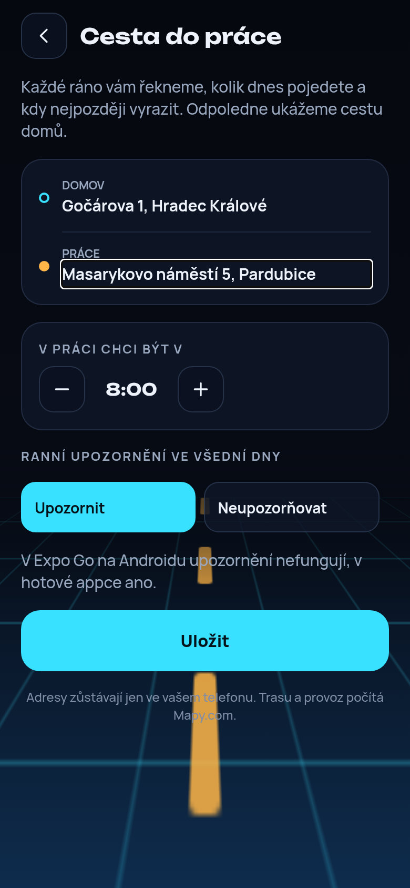
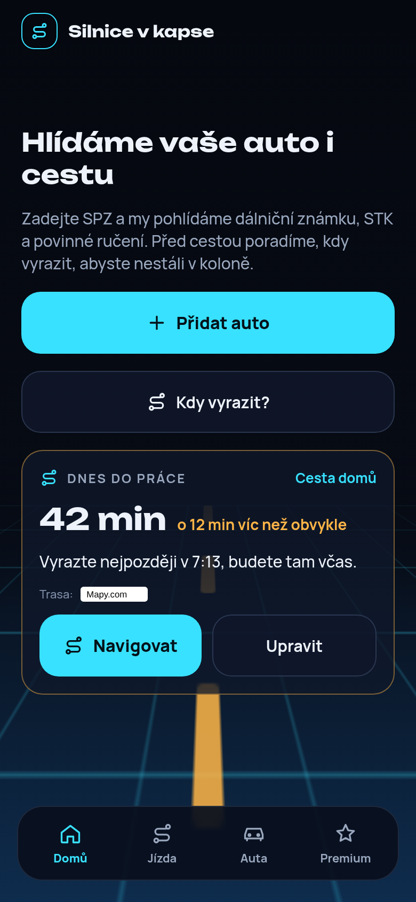
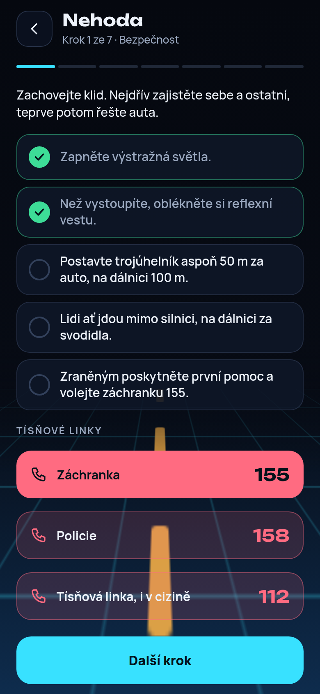
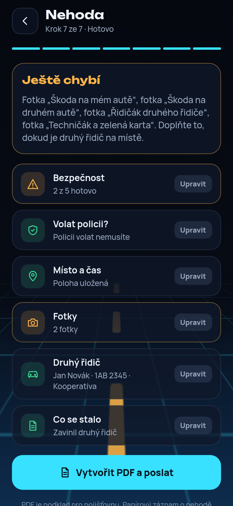
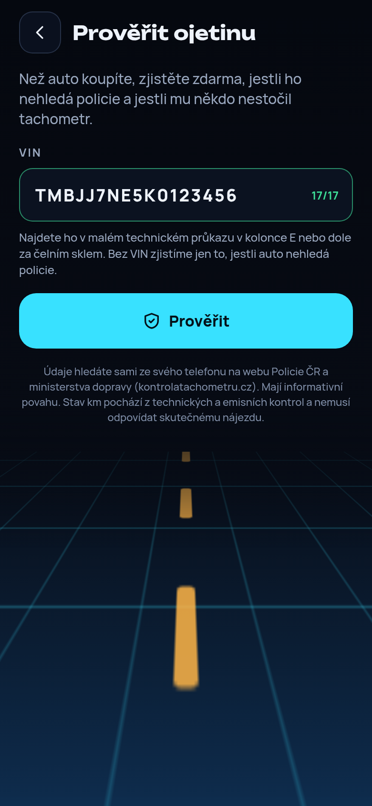

# Silnice v kapse

Mobilní appka pro Android a iOS, která hlídá auto a pomáhá s cestou:

- **Hlídání termínů.** Zadáte SPZ (a když chcete, i VIN) a appka zjistí a hlídá dálniční známku, technickou (STK) a povinné ručení. Měsíc, týden a den před koncem pošle upozornění.
- **Povinné ručení.** Ukáže tři nabídky: nejlepší cenu, stejnou cenu s více výhodami a placenou nabídku partnera.
- **Cesta do práce.** Jednou zadáte domov, práci a kdy tam chcete být. Každé ráno appka podle aktuálního provozu řekne, kolik dnes pojedete a kdy nejpozději vyrazit, odpoledne ukáže cestu domů. Ve všední dny může ráno připomenout, ať se podíváte.
- **Nehoda krok za krokem.** Po nehodě appka provede bezpečností, řekne, jestli volat policii, uloží místo a čas, vyfotí škody i doklady druhého řidiče a připraví PDF podklad pro pojišťovnu.
- **Prověřit ojetinu.** Před koupí auta appka zjistí, jestli ho nehledá policie jako kradené, a nakreslí historii tachometru z technických kontrol. Upozorní, když km šly dozadu. S Autokuk API navíc ukáže model, rok výroby, motor, první registraci, platnost STK, dovoz, počet majitelů, vyřazení z provozu a svolávací akce výrobce, a to i jen podle SPZ.
- **Kdy vyrazit.** Pro jízdu teď, dnes večer, zítra ráno nebo o víkendu spočítá nejlepší čas odjezdu.
- **Objížďky a nabíjení.** Poradí, jestli objet uzavírku, a majitelům elektroaut podle dojezdu navrhne nabíjení na trase.
- **Vozový park.** Zdarma je jedno auto, s předplatným Premium (29 Kč měsíčně) neomezeně aut a žádná reklama.

## Jak to vypadá

| Domů | Přidání auta | Ověření | Ruční datum | Bez auta |
| --- | --- | --- | --- | --- |
|  |  |  |  |  |

| Povinné ručení | Kdy vyrazit | Trasa | Vozový park | Premium |
| --- | --- | --- | --- | --- |
|  |  |  |  |  |

| Cesta do práce | Ráno na domovské stránce | Nehoda: bezpečnost | Nehoda: shrnutí | Prověřit ojetinu |
| --- | --- | --- | --- | --- |
|  |  |  |  |  |

## Jak si appku vyzkoušet na telefonu

Potřebujete počítač s [Node.js](https://nodejs.org) (verze 20 nebo novější) a v telefonu aplikaci **Expo Go** (Google Play nebo App Store).

1. Stáhněte si tento repozitář a otevřete jeho složku v terminálu.
2. Nainstalujte balíčky: `npm ci` (nainstaluje přesně verze z repozitáře a nic v něm nezmění)
3. Spusťte vývojový server: `npx expo start`
4. V terminálu se objeví QR kód. Na Androidu ho naskenujte v Expo Go, na iPhonu fotoaparátem. Telefon a počítač musí být na stejné Wi-Fi.

Appka se otevře v telefonu a každá změna v kódu se v ní hned projeví.

Expo Go na Androidu nepodporuje upozornění, proto je tam appka vynechá. Všechno ostatní funguje. Upozornění na termíny vyzkoušíte až ve vlastním sestavení appky (`npx eas-cli@latest build --profile development`) nebo na iPhonu.

Rychlý náhled v prohlížeči spustíte příkazem `npx expo start --web`. Ověřování z oficiálních webů a upozornění v prohlížeči nefungují, data se tam zadávají ručně.

## Odkud appka bere údaje o autě

Placené Autokuk API appka použije, jen když je nastavený náš server (viz níže). Bez něj zkouší zdarma zdroje v tomto pořadí a co nenajde, zkusí v dalším:

1. **Oficiální weby přímo v telefonu.** Appka otevře na pozadí eDálnici (dálniční známka, edalnice.gov.cz), overeniauta.cz (VIN a STK) a kontrolatachometru.cz (STK podle VIN). Vyplní SPZ nebo VIN a výsledek přečte. Klient ty stránky nevidí. Když web chce opsat kód z obrázku nebo potvrdit „nejsem robot“, appka mu to ukáže a klient to udělá sám.
2. **Ruční zadání.** Co se nepodaří zjistit, klient zadá tlačítky (den, měsíc, rok).

**Prověření ojetiny** se nejdřív zeptá Autokuku (kradené auto, tachometr, údaje o autě). Co Autokuk nevrátí nebo když neodpoví, appka zjistí zdarma: v telefonu otevře pátrání po vozidlech na policie.gov.cz (podle VIN nebo SPZ) a kontrolatachometru.cz (podle VIN). Kód z obrázku opíše klient sám. Bez serveru appka používá jen tyhle bezplatné weby.

**Povinné ručení** appka sama nezjišťuje. Vyhledávání pojistitele u ČKP je určené jen poškozeným po dopravní nehodě (formulář chce čestné prohlášení) a ukazuje jen pojišťovnu, ne konec smlouvy. Klient proto vybere pojišťovnu tlačítkem a zadá výročí ze smlouvy nebo zelené karty. Appka pak výročí hlídá každý rok.

VIN může klient zadat sám při přidání auta nebo později na domovské stránce. Zadaný VIN appka nikdy nepřepíše a použije ho k ověření STK na kontrolatachometru.cz, když ji jiné zdroje nenajdou.

## Mapa a trasa (Mapy.com)

Trasu, vzdálenost a dobu jízdy appka hledá přes [Mapy.com API](https://developer.mapy.com/). Tarif Basic je zdarma (250 000 kreditů měsíčně, hledání místa i trasy stojí 4 kredity) a nechce platební kartu. Mapu kreslí [OpenFreeMap](https://openfreemap.org/), ten je zdarma a klíč nepotřebuje.

1. Na [developer.mapy.com](https://developer.mapy.com/) se vpravo nahoře přihlaste účtem Seznam a vytvořte nový projekt. Klíč se v něm vytvoří sám.
2. V hlavní složce zkopírujte `.env.example` jako `.env` (pokud ho ještě nemáte) a doplňte klíč: `EXPO_PUBLIC_MAPY_API_KEY=váš-klíč`
3. Zastavte a znovu spusťte `npx expo start`. Samotné `r` nestačí, klíč se načítá jen při startu.

Soubor `.env` se do GitHubu nedává. Klíč ale bude uvnitř hotové appky, proto v něm nesmí být placený tarif bez limitu. U tarifu Basic se bez vašeho souhlasu nic neplatí.

Bez klíče appka trasu nehledá a ukáže ukázkovou dobu jízdy.

**Uzavírky** dodá Národní dopravní informační centrum ŘSD (data JSDI ve formátu DATEX II). Jsou zdarma, ale o přístup se žádá e-mailem na mobilitydata@rsd.cz. Appka pak musí vždy uvádět zdroj „ŘSD ČR – JSDI – www.dopravniinfo.cz“. Data chodí na server, proto je bude přijímat náš server na Cloudflare a appce pošle jen uzavírky na trase. Objížďku appka předá do navigace jako průjezdní bod (spolehlivě to umí Mapy.com, Waze to neumí).

## Zapnutí Autokuk API

Autokuk.cz podle VIN nebo SPZ vrátí najednou údaje o autě, technické prohlídky, historii tachometru, dovoz, vyřazení z provozu, majitele, pátrání policie (CZ a SK) a dálniční známku. API je v tarifech Profi (299 Kč měsíčně, 75 prověření denně, 10 dotazů za minutu, komerční použití), Business a Enterprise. Denní limit se sdílí s vyhledáváním na webu Autokuku a resetuje se o půlnoci. Když dojde, appka prověří auto zdarma na webech úřadů. Appka se pak zeptá nejdřív Autokuku a oficiální weby použije jen pro to, co Autokuk nevrátí (například povinné ručení). Při prověření ojetiny se stejné auto podruhé za sebou znovu neptá, ať se zbytečně nečerpají dotazy.

Klíč k Autokuk API nesmí být v appce, jinak by si ho kdokoli vytáhl a čerpal z vašeho tarifu. Proto mezi appkou a Autokukem stojí malý server na Cloudflare (zdarma do 100 000 dotazů denně).

1. Založte si účet na [cloudflare.com](https://dash.cloudflare.com/sign-up) a na [autokuk.cz](https://autokuk.cz/) s tarifem, který povoluje komerční použití API.
2. V terminálu přejděte do složky serveru: `cd server`
3. Přihlaste se: `npx wrangler login`
4. Nahrajte server: `npx wrangler deploy`. Na konci vypíše adresu, například `https://silnice-v-kapse-api.vas-ucet.workers.dev`.
5. Uložte klíč jako tajnou hodnotu (terminál se na něj zeptá, nikam ho nepište ani neposílejte): `npx wrangler secret put AUTOKUK_API_KEY`
6. Volitelně nastavte heslo appky, které odfiltruje cizí dotazy: `npx wrangler secret put APP_TOKEN`
7. Do souboru `.env` v hlavní složce (když ho nemáte, zkopírujte `.env.example`) doplňte `EXPO_PUBLIC_API_URL=` a adresu serveru (a heslo appky, pokud jste ho nastavili).
8. Restartujte `npx expo start`.

Převod odpovědi je v `server/src/autokuk.ts` podle [schématu Autokuk API](https://autokuk.cz/api/openapi.yaml). Platnost STK Autokuk nevrací, server ji odhadne jako poslední prohlídku, při které bylo auto způsobilé, plus 2 roky. Kradené auto appka převezme z Autokuku, jen když česká kontrola výslovně nic nenašla nebo některá kontrola auto našla. Jinak se zeptá webu policie. Jména a adresy majitelů server appce nikdy nepošle, jen jejich počet. Do logu na Cloudflare (Workers & Pages, silnice-v-kapse-api, Logs) zapisuje jen chyby Autokuku a kolik dotazů dnes zbývá.

## Co je skutečné a co zatím ukázka

| Část | Stav |
| --- | --- |
| Přidání auta, vozový park, limit jednoho auta zdarma | Funguje, data se ukládají v telefonu |
| Upozornění 30, 7 a 1 den před koncem termínu | Funguje v telefonu (ne v prohlížeči) |
| Ověření z oficiálních webů v telefonu | Hotové, ale adresy a formuláře je nutné vyzkoušet na skutečném telefonu |
| Zadání VIN při přidání auta a na domovské stránce | Funguje |
| Zjištění údajů přes Autokuk API | Hotové podle schématu Autokuku, zapne se adresou serveru v `.env`. Ještě nevyzkoušené se skutečným klíčem |
| Ruční zadání dat, pojišťovna a výročí ručení tlačítky | Funguje |
| Ceny povinného ručení a tři nabídky | Ukázková data, chybí partner (pojišťovna nebo srovnávač) |
| Trasa, vzdálenost a mapa | Funguje s klíčem Mapy.com |
| Cesta do práce: dnešní doba jízdy a kdy vyrazit | Funguje s klíčem Mapy.com, doba jízdy je podle aktuálního provozu |
| Ranní připomínka cesty do práce | Funguje v telefonu (ne v Expo Go na Androidu ani v prohlížeči) |
| Nehoda krok za krokem: policie, fotky, poloha, PDF podklad | Funguje v telefonu. Pravidla pro policii podle zákona 361/2000 Sb. platná od 1. 7. 2025 (škoda nad 200 000 Kč). V prohlížeči se místo PDF otevře tisk |
| Prověření ojetiny: kradené auto a historie tachometru | Hotové. S Autokukem i údaje o autě, dovoz a vyřazení z provozu. Čtení výsledků z webu policie a kontroly tachometru je nutné vyzkoušet na skutečném telefonu |
| Nejlepší čas odjezdu | Délka jízdy z Mapy.com, zdržení ve špičkách zatím odhadujeme |
| Uzavírky a objížďky | Chybí, čeká na přístup k datům ŘSD |
| Nabíjení elektroaut | Podle délky trasy pozná, jestli auto dojede. Mapa nabíječek chybí |
| Reklama | Jen místo pro banner |
| Předplatné Premium | Testovací přepínač, skutečné platby chybí |

## Co je potřeba udělat před spuštěním

- **Data o autě.** Vyzkoušet eDálnici, overeniauta.cz, kontrolatachometru.cz a pátrání policie na skutečném telefonu a ověřit jejich podmínky použití. Obchodní podmínky Autokuku povolují komerční použití přes API, ale neříkají nic o zobrazování výsledků uživatelům jiné appky ani o ukládání. Před spuštěním to potvrdit e-mailem na info@autokuk.cz a hlídat, jestli stačí 75 prověření denně.
- **Povinné ručení.** Zprostředkovat pojištění smí jen registrovaný subjekt u ČNB. Nejjednodušší je partnerský (affiliate) program srovnávače nebo pojišťovny. Placenou nabídku partnera je nutné v appce označit jako reklamu, to už appka dělá.
- **Doprava a mapy.** Získat přístup k uzavírkám ŘSD a nechat si potvrdit použití v appce s reklamou a předplatným. Napojit mapu nabíječek (Open Charge Map) a nahradit odhad zdržení ve špičkách skutečnými daty.
- **Peníze.** Reklama přes Google AdMob, předplatné přes Google Play a App Store (vývojářský účet Google stojí jednorázově 25 USD, Apple 99 USD ročně).
- **Vydání.** Sestavit appku přes EAS Build (`npx eas build`) a nahrát do obchodů. Doplnit zásady ochrany osobních údajů.

## Pro vývojáře

- Expo SDK 57, React Native 0.86, TypeScript, Expo Router (obrazovky v `src/app/`).
- `npm run typecheck`, `npm run lint` a `npm test` musí projít před každou změnou.
- `src/lib/lookup/` obsahuje ověřování z oficiálních webů (skrytý WebView, skript pro vyplnění formuláře a čtení výsledku).
- `src/lib/vehicleApi.ts` volá náš server, `server/` je Cloudflare Worker pro Autokuk API (`/vehicle` při přidání auta, `/used-car` pro prověření ojetiny). Bez `EXPO_PUBLIC_API_URL` v `.env` se server nevolá vůbec.
- Balíčky instalujte přes `npx expo install <balíček>`, aby seděly k verzi Expa.
