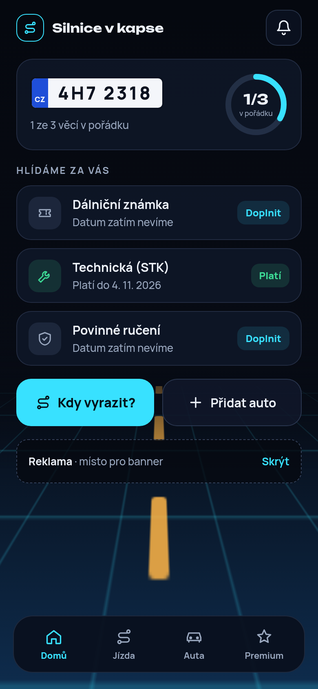
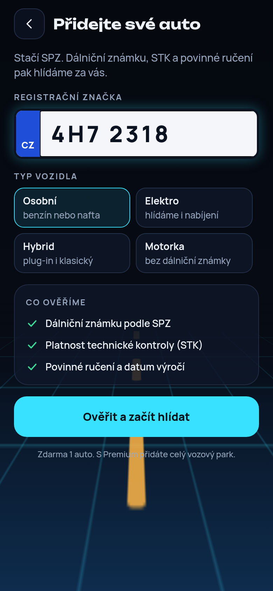
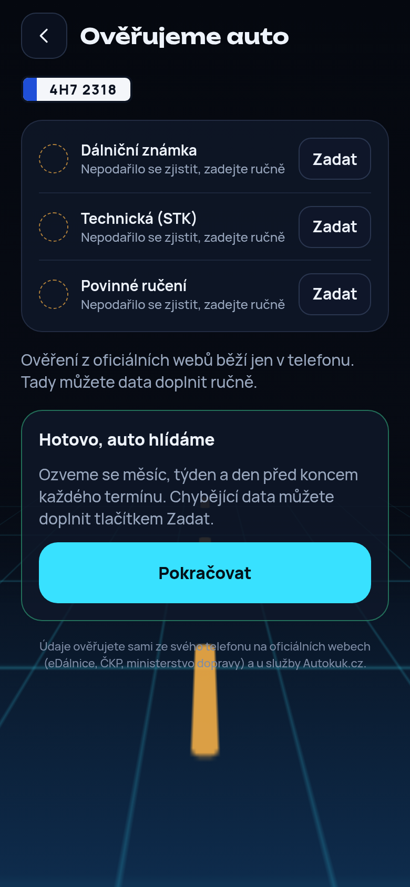
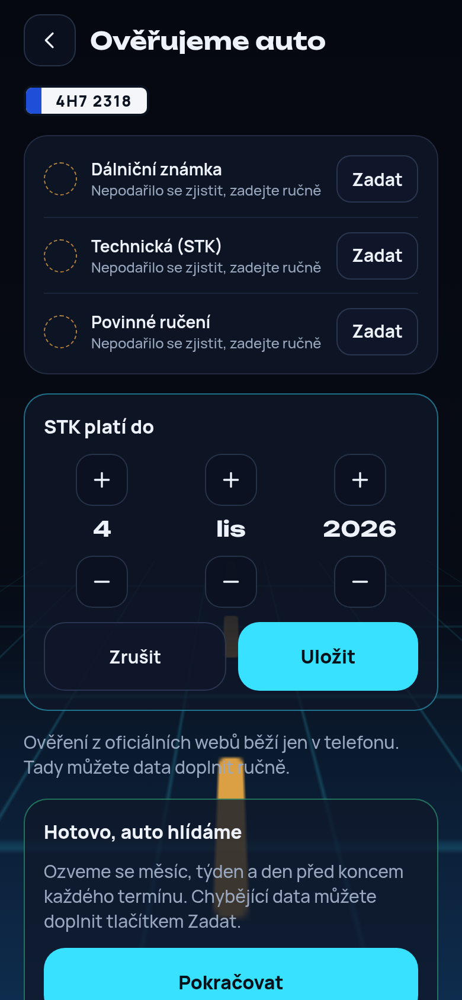
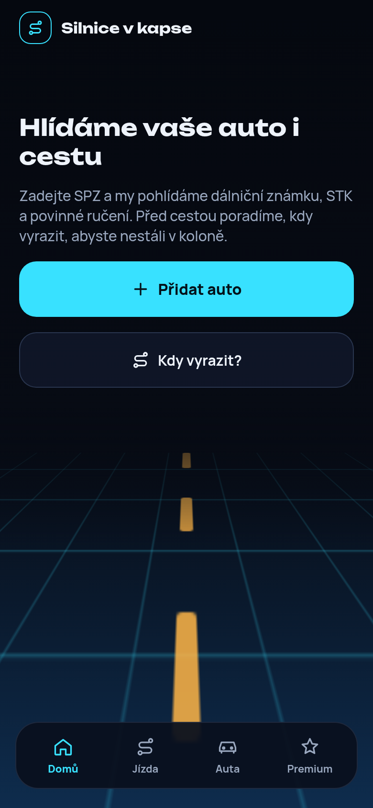
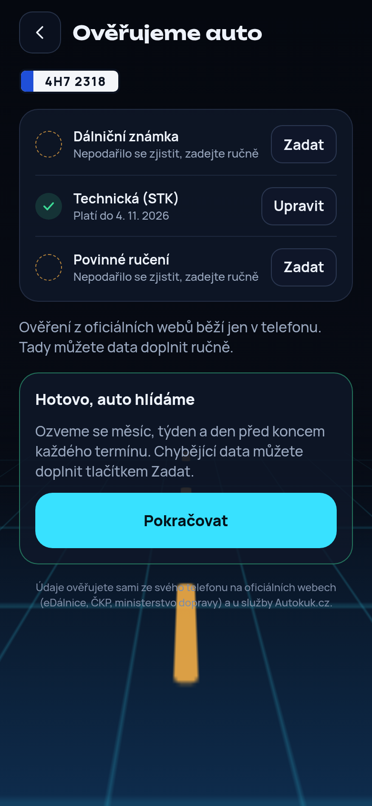
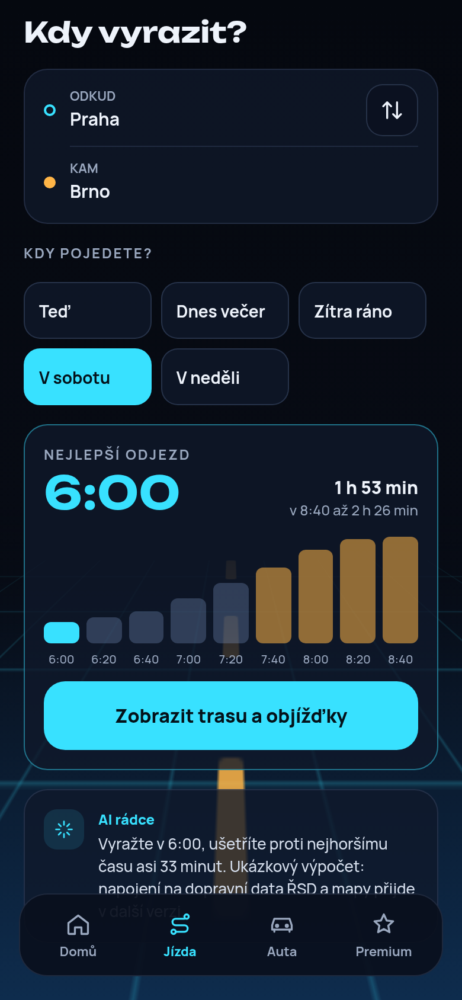
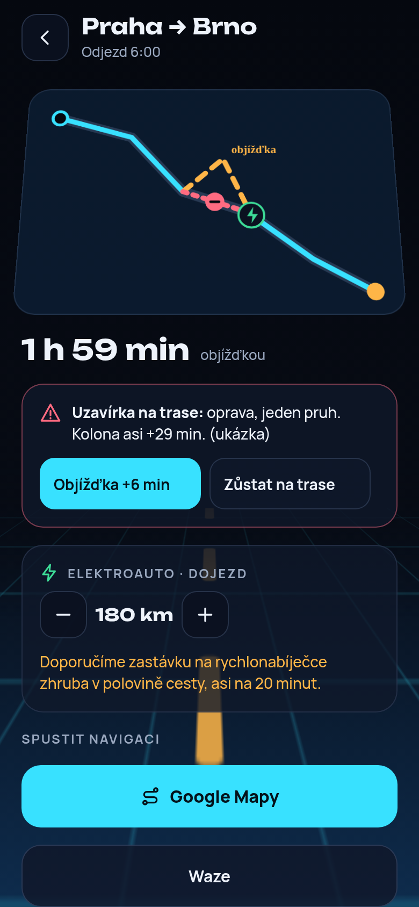
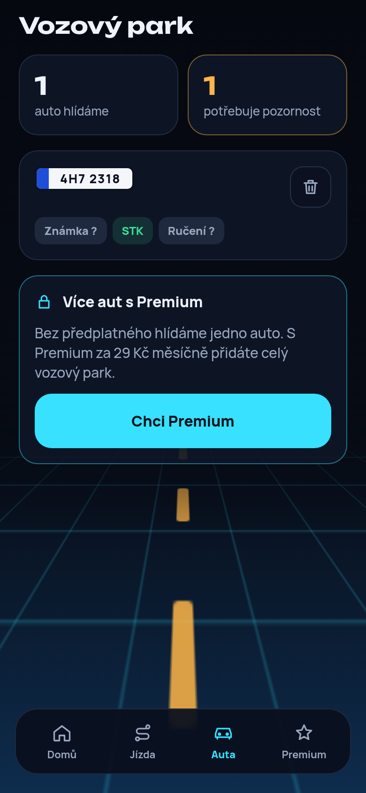
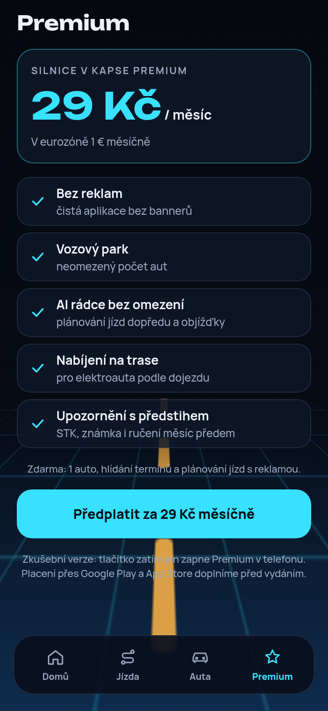

# Silnice v kapse

Mobilní appka pro Android a iOS, která hlídá auto a pomáhá s cestou:

- **Hlídání termínů.** Zadáte SPZ (a když chcete, i VIN) a appka zjistí a hlídá dálniční známku, technickou (STK) a povinné ručení. Měsíc, týden a den před koncem pošle upozornění.
- **Povinné ručení.** Ukáže tři nabídky: nejlepší cenu, stejnou cenu s více výhodami a placenou nabídku partnera.
- **Kdy vyrazit.** Pro jízdu teď, dnes večer, zítra ráno nebo o víkendu spočítá nejlepší čas odjezdu.
- **Objížďky a nabíjení.** Poradí, jestli objet uzavírku, a majitelům elektroaut podle dojezdu navrhne nabíjení na trase.
- **Vozový park.** Zdarma je jedno auto, s předplatným Premium (29 Kč měsíčně) neomezeně aut a žádná reklama.

## Jak to vypadá

| Domů | Přidání auta | Ověření | Ruční datum | Bez auta |
| --- | --- | --- | --- | --- |
|  |  |  |  |  |

| Povinné ručení | Kdy vyrazit | Trasa | Vozový park | Premium |
| --- | --- | --- | --- | --- |
|  |  |  |  |  |

## Jak si appku vyzkoušet na telefonu

Potřebujete počítač s [Node.js](https://nodejs.org) (verze 20 nebo novější) a v telefonu aplikaci **Expo Go** (Google Play nebo App Store).

1. Stáhněte si tento repozitář a otevřete jeho složku v terminálu.
2. Nainstalujte balíčky: `npm install`
3. Spusťte vývojový server: `npx expo start`
4. V terminálu se objeví QR kód. Na Androidu ho naskenujte v Expo Go, na iPhonu fotoaparátem. Telefon a počítač musí být na stejné Wi-Fi.

Appka se otevře v telefonu a každá změna v kódu se v ní hned projeví.

Rychlý náhled v prohlížeči spustíte příkazem `npx expo start --web`. Ověřování z oficiálních webů a upozornění v prohlížeči nefungují, data se tam zadávají ručně.

## Odkud appka bere údaje o autě

Appka zatím nepoužívá žádnou placenou službu. Zkouší zdroje v tomto pořadí a co nenajde, zkusí v dalším:

1. **Oficiální weby přímo v telefonu.** Appka otevře na pozadí eDálnici (dálniční známka), overeniauta.cz (VIN a STK), kontrolatachometru.cz (STK podle VIN) a ČKP (pojišťovna a výročí povinného ručení). Vyplní SPZ nebo VIN a výsledek přečte. Klient ty stránky nevidí. Když web chce opsat kód z obrázku, appka ho ukáže ve svém vzhledu a klient ho opíše sám.
2. **Ruční zadání.** Co se nepodaří zjistit, klient zadá tlačítky (den, měsíc, rok).

VIN může klient zadat sám při přidání auta nebo později na domovské stránce. Zadaný VIN appka nikdy nepřepíše a použije ho k ověření STK na kontrolatachometru.cz, když ji jiné zdroje nenajdou.

## Volitelně: zapnutí Autokuk API

Autokuk.cz podle SPZ vrátí VIN, značku, platnost STK a dálniční známky najednou, ale pro komerční použití vyžaduje placený tarif (za 299 Kč). Zatím ho nepoužíváme. Kód je připravený, takže ho jde kdykoli zapnout. Appka se pak zeptá nejdřív Autokuku a oficiální weby použije jen pro to, co Autokuk nevrátí (například povinné ručení).

Klíč k Autokuk API nesmí být v appce, jinak by si ho kdokoli vytáhl a čerpal z vašeho tarifu. Proto mezi appkou a Autokukem stojí malý server na Cloudflare (zdarma do 100 000 dotazů denně).

1. Založte si účet na [cloudflare.com](https://dash.cloudflare.com/sign-up) a na [autokuk.cz](https://autokuk.cz/) s tarifem, který povoluje komerční použití API.
2. V terminálu přejděte do složky serveru: `cd server`
3. Přihlaste se: `npx wrangler login`
4. Uložte klíč jako tajnou hodnotu (terminál se na něj zeptá, nikam ho nepište ani neposílejte): `npx wrangler secret put AUTOKUK_API_KEY`
5. Volitelně nastavte heslo appky, které odfiltruje cizí dotazy: `npx wrangler secret put APP_TOKEN`
6. Nahrajte server: `npx wrangler deploy`. Na konci vypíše adresu, například `https://silnice-v-kapse-api.vas-ucet.workers.dev`.
7. V hlavní složce zkopírujte `.env.example` jako `.env` a doplňte do něj adresu serveru (a heslo appky, pokud jste ho nastavili).
8. Restartujte `npx expo start`.

Přesný tvar odpovědi Autokuk API není veřejně popsaný, proto server hledá údaje podle názvů polí (`server/src/autokuk.ts`). Po prvním skutečném dotazu je dobré převod podle reálné odpovědi zpřesnit.

## Co je skutečné a co zatím ukázka

| Část | Stav |
| --- | --- |
| Přidání auta, vozový park, limit jednoho auta zdarma | Funguje, data se ukládají v telefonu |
| Upozornění 30, 7 a 1 den před koncem termínu | Funguje v telefonu (ne v prohlížeči) |
| Ověření z oficiálních webů v telefonu | Hotové, ale adresy a formuláře je nutné vyzkoušet na skutečném telefonu |
| Zadání VIN při přidání auta a na domovské stránce | Funguje |
| Zjištění údajů přes Autokuk API | Připravené, ale vypnuté (placený tarif) |
| Ruční zadání dat | Funguje |
| Ceny povinného ručení a tři nabídky | Ukázková data, chybí partner (pojišťovna nebo srovnávač) |
| Nejlepší čas odjezdu | Ukázkový výpočet podle typické dopravní špičky |
| Trasa, uzavírky, objížďky | Ukázka, chybí napojení na dopravní data a mapy |
| Nabíjení elektroaut | Uloží dojezd, napojení na mapu nabíječek chybí |
| Reklama | Jen místo pro banner |
| Předplatné Premium | Testovací přepínač, skutečné platby chybí |

## Co je potřeba udělat před spuštěním

- **Data o autě.** Vyzkoušet eDálnici, ČKP, overeniauta.cz a kontrolatachometru.cz na skutečném telefonu a ověřit jejich podmínky použití. Autokuk API jde zapnout později, až se appka uživí.
- **Povinné ručení.** Zprostředkovat pojištění smí jen registrovaný subjekt u ČNB. Nejjednodušší je partnerský (affiliate) program srovnávače nebo pojišťovny. Placenou nabídku partnera je nutné v appce označit jako reklamu, to už appka dělá.
- **Doprava a mapy.** Napojit dopravní informace NDIC (DATEX II), plánování trasy (například Mapy.com API) a mapu nabíječek (Open Charge Map). Pak nahradit ukázkový výpočet odjezdu skutečným.
- **Peníze.** Reklama přes Google AdMob, předplatné přes Google Play a App Store (vývojářský účet Google stojí jednorázově 25 USD, Apple 99 USD ročně).
- **Vydání.** Sestavit appku přes EAS Build (`npx eas build`) a nahrát do obchodů. Doplnit zásady ochrany osobních údajů.

## Pro vývojáře

- Expo SDK 57, React Native 0.86, TypeScript, Expo Router (obrazovky v `src/app/`).
- `npm run typecheck`, `npm run lint` a `npm test` musí projít před každou změnou.
- `src/lib/lookup/` obsahuje ověřování z oficiálních webů (skrytý WebView, skript pro vyplnění formuláře a čtení výsledku).
- `src/lib/vehicleApi.ts` volá náš server, `server/` je Cloudflare Worker pro Autokuk API. Bez `EXPO_PUBLIC_API_URL` v `.env` se server nevolá vůbec.
- Balíčky instalujte přes `npx expo install <balíček>`, aby seděly k verzi Expa.
